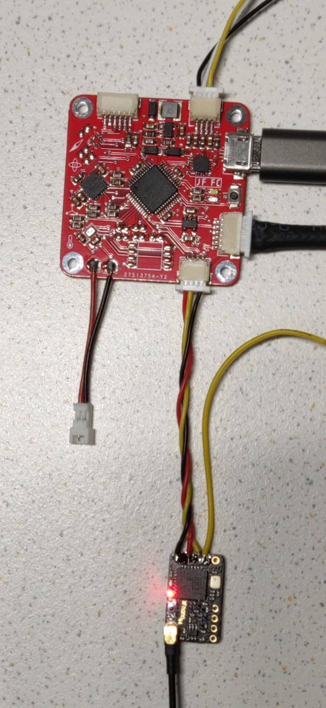

# SBUSinterface
This project consists of a small C module to communicate with SBUS-compadible receivers. 
The example implementation is for a Atmega4809 MCU.

# SBUS
SBUS data is sent in serial and every message is 25bytes long.
I found a great summary of the exact specification here: https://github.com/uzh-rpg/rpg_quadrotor_control/wiki/SBUS-Protocol 

# Hardware 

## Receiver
For the RC receiver, a **TBS crossfire Nano RX** is used. This receiver
can be configured to use non-inverting-sbus, which is needed for the UART peripheral of the MCU.

## Wiring
For the connection between the receiver and the MCU board, only three wires are needed.

| Wire   | MCU side  |       Receiver side |
| :----- | :-------- | ------------------: |
| black  | GND       |                 GND |
| red    | 5V        |                  5V |
| yellow | PC5 (RX1) | CH.OUT1 (n.i. SBUS) |

### Test probing
For debugging porpouses, I probed the following pins with my scope:

PC5 - to see the SBUS data.

PA3 - as a output, which gets set and cleared withing the Uart Rx Interrupt, to see if all the timing constraints are met.

# Software

## Channel mapping
The channel mapping can be configured on the transmitter. In my case, it is a following:

| Channel Nr. | Function |
| :---------- | -------: |
| 0           |     Roll |
| 1           |    Pitch |
| 2           | Throttle |
| 3           |      Yaw |